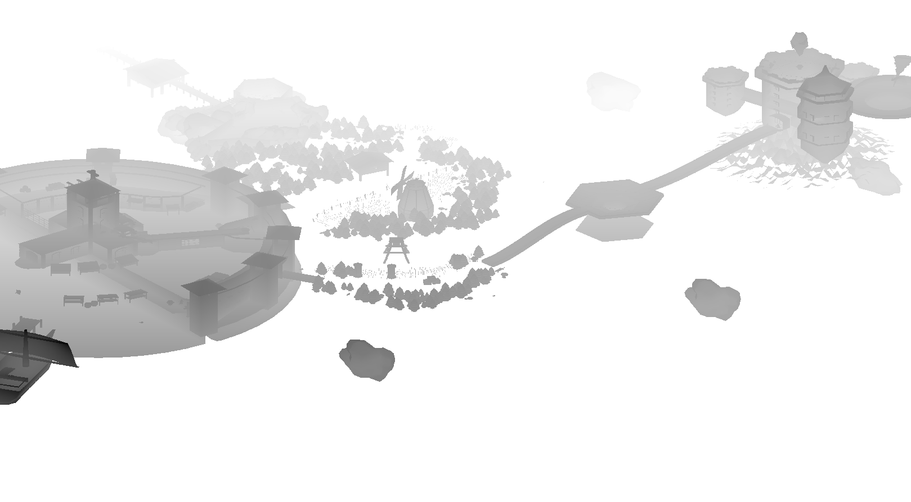

import YouTube from '../../components/YouTube'

The Little Light Engine is a C++ program developed side by side with a small narrative game in which the player plays a vampire trying to avoid lights. The goal of the project was to develop a game independently of established game engines such as Unreal Engine and Unity and to then build an engine around the code basis, allowing for the creation of more games. In the end, Little Light Engine provides functionalities that allow the user to quickly develop 3d games incorporating directional, spot, and point lights with real-time shadows, as well as other functionalities important for creating games. 

The game was created as part of the GameLab 3 project at the Julius-Maximilian-University of Würzburg.

Using: C++, OpenGL, Blender

<YouTube id="7kJk3F8UFis?si=2Br1h9sDj1WN3sNC"/>

Sweeping camera view

Visualized hitboxes

Depthmap render for shadows

In engine render